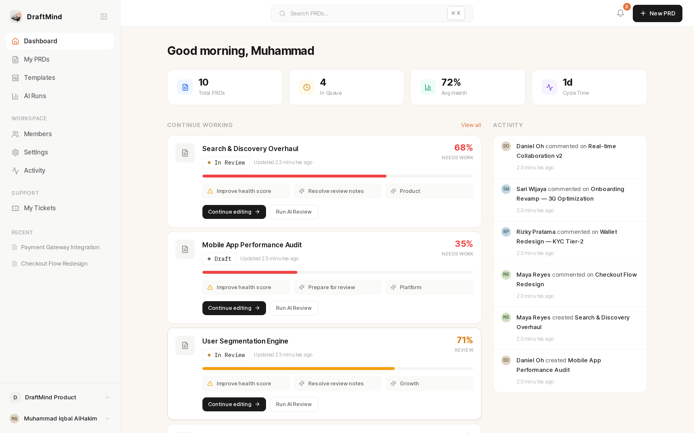
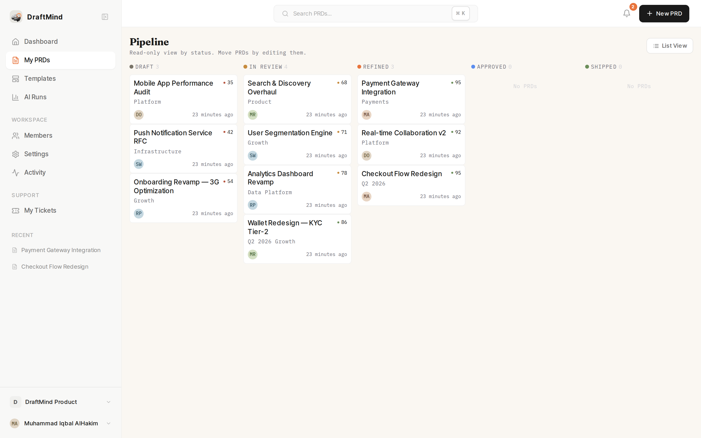
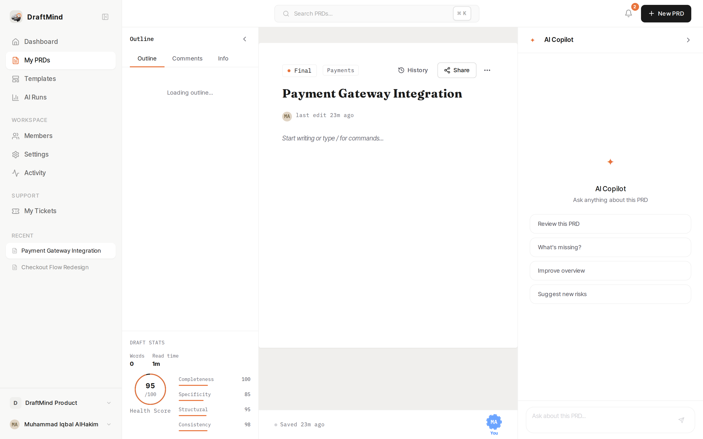
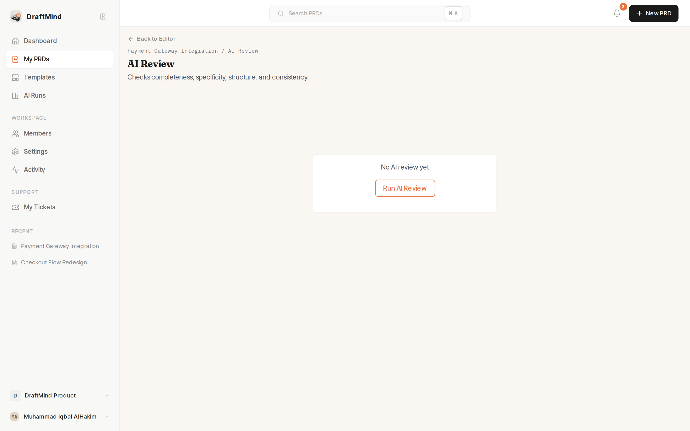
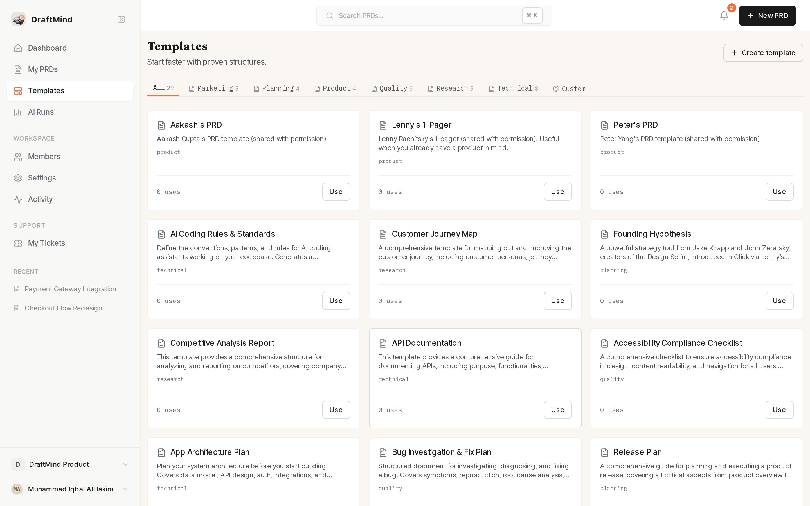
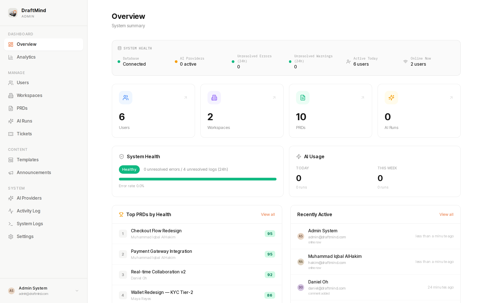
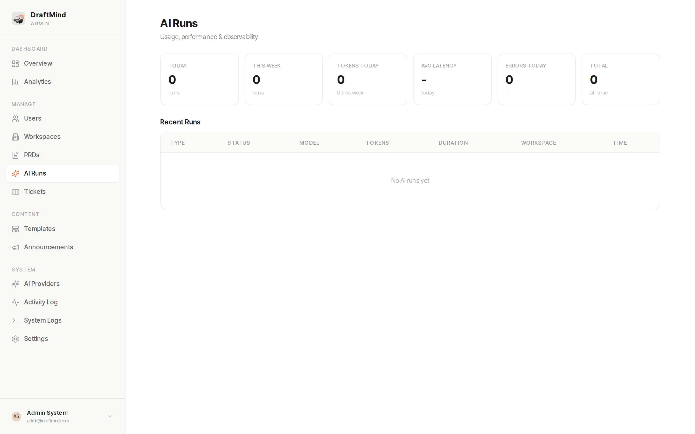
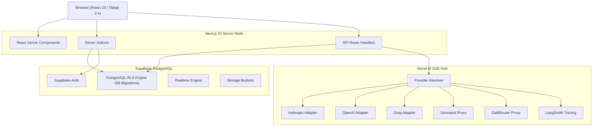

<p align="center">
  
</p>

<h1 align="center">DraftMind</h1>

<p align="center">
  <strong>Multi-tenant AI PRD platform for B2B product and engineering teams.</strong>
</p>

<p align="center">
  <a href="https://nextjs.org/"></a>
  <a href="https://www.typescriptlang.org/"></a>
  <a href="https://supabase.com/"></a>
  <a href="https://tiptap.dev/"></a>
  <a href="https://sdk.vercel.ai/"></a>
  
</p>

---

DraftMind is a web application for drafting, auditing, and managing Product Requirement Documents (PRDs). Built with Next.js 15, Supabase PostgreSQL with Row Level Security (RLS), and Vercel AI SDK v4, it provides workspace-isolated PRD editing with multi-provider AI support (Anthropic, OpenAI, Groq, Sumopod, GaNRouter).

---

## Key Features

### PRD Authoring & Lifecycle

- **Block Editor**: Custom Tiptap block editor supporting Objectives, User Stories, Key Metrics, Requirements, and Risk Nodes.
- **9-Stage Status Workflow**: Track documents across `draft`, `in_review`, `reviewed`, `refined`, `final`, `blocked`, `approved`, `shipped`, and `archived`.
- **Kanban Pipeline**: Visual status board with drag-and-drop workflow updates.
- **Auto-Save & Snapshot History**: Dual auto-save triggers (3s idle debounce + 5m interval) with full diff comparison and version restore.
- **Granular Public Sharing**: Token-based public links with configurable expiration. Hidden sections are filtered at the query layer before public rendering.

### AI Integration & Observability

- **Full PRD Generation**: Generates structured PRDs from raw briefs using Vercel AI SDK.
- **Automated Health Score (0-100)**: Evaluates PRD completeness, readability score, structural clarity, and edge-case coverage.
- **In-Context AI Actions**: 13 inline transformation actions including section rewriting, table conversion, metric extraction, and translation.
- **Multi-Provider Fallback Registry**: Runtime provider resolution across Anthropic, OpenAI, Groq, Sumopod, and GaNRouter.
- **Provider Encryption & Tracing**: Provider API keys encrypted with AES-256-GCM at rest. AI executions log to `ai_runs` and support optional LangSmith tracing.

### Multi-Tenancy & Collaboration

- **Database Level Isolation**: Multi-tenant data segregation enforced via PostgreSQL RLS policies.
- **Role-Based Access Control (RBAC)**: Workspace roles (`admin`, `editor`, `commenter`, `viewer`) guarding read, write, export, and deletion endpoints.
- **Inline Commenting**: Section-anchored comment threads with resolution state and member `@mentions`.
- **Realtime Presence**: Active user detection and online status thresholding.

### Multi-Format Export

- **PDF**: Server-side PDF generation via Puppeteer Core and `@sparticuz/chromium`.
- **DOCX**: Native Microsoft Word document output.
- **Atlassian Jira / Confluence**: Formatted ADF/Jira wiki markup export.
- **Slack**: Block Kit JSON payload generation for team channels.
- **Markdown & HTML**: Clean GFM markdown and standalone HTML exports.

### Platform Administration

- **System Telemetry**: Platform-wide metrics for user growth, active workspaces, PRDs by status, and AI execution latency.
- **Audit & System Logs**: Real-time error and activity logs with filterable severity levels and JSON export.
- **Support Ticket System**: User-submitted support tickets with admin workflow state.
- **Broadcast Announcements**: In-app notifications targeting specific workspace roles or platform users.

---

## Visual Overview

### Workspace Dashboard & Feed

Active workspace documents, recent team activity, and quick-start actions.


### Kanban Pipeline Board

Visual lifecycle management across 9 document status stages.


### Tiptap Block Editor & AI Assistant

Document editor with custom block nodes, floating toolbar, and inline AI copilot.


### AI Quality Audit & Health Score

Structural completeness and readability score breakdown (0-100).


### Template Library

Pre-built templates for Feature PRDs, RFCs, Technical Specs, and Product Briefs.


### Admin Panel & System Health

Super-admin controls for user management, workspace auditing, and system logs.


### AI Runs & Provider Telemetry

Execution logs, token accounting, latency metrics, and error rates per provider.


---

## Technical Stack

| Layer               | Component                | Version        | Description                                                           |
| :------------------ | :----------------------- | :------------- | :-------------------------------------------------------------------- |
| **Framework**       | Next.js (App Router)     | `15.0.4`       | Server Components, Server Actions, Route Handlers                     |
| **Language**        | TypeScript               | `5.5.4`        | Strict mode enabled                                                   |
| **UI Library**      | React                    | `19.0.0`       | Client & server component architecture                                |
| **Styling**         | Tailwind CSS             | `3.4.17`       | Utility-first styling with custom CSS design tokens                   |
| **Component Base**  | Radix UI                 | Latest         | Accessible unstyled primitives (Dialog, Select, Tabs, Popover)        |
| **State**           | Zustand & TanStack Query | `4.5` / `5.50` | Ephemeral client state (Zustand) + Server state caching (React Query) |
| **Editor**          | Tiptap (ProseMirror)     | `2.27.x`       | Custom ProseMirror extensions and block serialization                 |
| **Database & Auth** | Supabase (PostgreSQL)    | `2.45.0`       | Row Level Security, Auth, Realtime, Storage                           |
| **AI SDK**          | Vercel AI SDK            | `4.0.0`        | Model abstraction layer and streaming handlers                        |
| **AI Adapters**     | `@ai-sdk/*`              | `1.0.0`        | Official Anthropic, OpenAI, Groq SDK adapters + OAI proxies           |
| **Document Export** | Puppeteer Core / docx    | `23.0` / `8.5` | Headless Chromium PDF & native DOCX serialization                     |
| **Observability**   | LangSmith                | `0.6.0`        | AI call tracing and token usage auditing                              |
| **Email**           | Resend                   | `6.12.2`       | Transactional email delivery for invites                              |
| **Validation**      | Zod                      | `3.23.0`       | End-to-end schema validation                                          |
| **Testing**         | Vitest & Playwright      | `2.0` / `1.46` | Unit/smoke testing (Vitest) + E2E browser automation (Playwright)     |

---

## Architecture Overview



---

## Security & Multi-Tenancy

- **Row Level Security (RLS)**: Enforced across all public PostgreSQL tables (`prds`, `workspaces`, `workspace_members`, `comments`, etc.). Workspace ID constraints are validated at the query layer.
- **Encrypted Secrets**: Provider API keys stored in the database are encrypted using AES-256-GCM.
- **Immutable Audit Trail**: Critical system state modifications and admin operations are stored in append-only audit tables.

---

## Quickstart (Local Development)

### Requirements

- Node.js `>= 20.11.0` (Use `.nvmrc` via `nvm use`)
- pnpm `>= 9.x`
- Docker (Required for local Supabase instance)

### 1. Clone & Install

```bash
git clone https://github.com/HakimIqbal/draftmind.git
cd draftmind
nvm use
pnpm install
```

### 2. Environment Setup

```bash
cp .env.example .env.local
```

Generate an encryption key:

```bash
node -e "console.log(require('crypto').randomBytes(32).toString('base64'))"
```

Set the output as `ENCRYPTION_KEY` in `.env.local`.

### 3. Database Initialization

```bash
pnpm db:start   # Starts Supabase via Docker
pnpm db:reset   # Runs all 58 migrations + seeds test data
```

Copy `NEXT_PUBLIC_SUPABASE_ANON_KEY` and `SUPABASE_SERVICE_ROLE_KEY` from the Supabase CLI output into `.env.local`.

### 4. Run Development Server

```bash
pnpm dev
```

Access the application at `http://localhost:3000`.

---

## Pre-Seeded Accounts

Running `pnpm db:reset` generates the following test accounts:

| Email                  | Password    | Access Level               |
| :--------------------- | :---------- | :------------------------- |
| `admin@draftmind.com`  | `admin1234` | Super Admin (System Panel) |
| `hakim@draftmind.com`  | `user1234`  | Workspace Admin            |
| `maya@draftmind.com`   | `user1234`  | Workspace Editor           |
| `rizky@draftmind.com`  | `user1234`  | Workspace Editor           |
| `sari@draftmind.com`   | `user1234`  | Workspace Commenter        |
| `daniel@draftmind.com` | `user1234`  | Workspace Viewer           |

---

## Environment Variables Reference

| Variable                        | Scope  | Required | Purpose                                       |
| :------------------------------ | :----: | :------: | :-------------------------------------------- |
| `NEXT_PUBLIC_SUPABASE_URL`      |  Both  |   Yes    | Supabase endpoint URL                         |
| `NEXT_PUBLIC_SUPABASE_ANON_KEY` |  Both  |   Yes    | Supabase anonymous API key                    |
| `SUPABASE_SERVICE_ROLE_KEY`     | Server |   Yes    | Supabase service role key (bypasses RLS)      |
| `DATABASE_URL`                  | Server |   Yes    | Direct PostgreSQL connection string           |
| `NEXT_PUBLIC_APP_URL`           |  Both  |   Yes    | Application base URL                          |
| `ENCRYPTION_KEY`                | Server |   Yes    | 32-byte Base64 key for AES-256-GCM encryption |
| `DEPLOYMENT_TARGET`             | Server |    No    | Deployment target (`local`, `vercel`, `vps`)  |
| `SKIP_ENV_VALIDATION`           | Build  |    No    | Set to `true` during Docker build phase       |
| `RESEND_API_KEY`                | Server |    No    | Resend API key for transactional emails       |
| `EMAIL_FROM`                    | Server |    No    | Transactional email sender address            |
| `LANGCHAIN_API_KEY`             | Server |    No    | LangSmith tracing API key                     |
| `LANGCHAIN_PROJECT`             | Server |    No    | LangSmith project name                        |
| `LANGCHAIN_TRACING_V2`          | Server |    No    | Set to `true` for active LangSmith tracing    |
| `SUPABASE_WEBHOOK_SECRET`       | Server |    No    | HMAC secret for verifying webhooks            |

---

## Production Deployment

### Docker (VPS Deployment)

DraftMind uses a multi-stage Docker build producing a standalone Next.js server output:

```bash
# Build image
docker build -t draftmind:latest .

# Run container
docker run -d -p 3000:3000 --env-file .env.production --name draftmind draftmind:latest
```

Or using Docker Compose:

```bash
docker compose up -d
```

### Vercel Deployment

1. Import repository to Vercel.
2. Configure required environment variables in project settings.
3. Set `DEPLOYMENT_TARGET=vercel`.
4. Deploy.

### Production Migrations

Apply database migrations to remote Supabase:

```bash
supabase link --project-ref <your-project-ref>
supabase db push
```

---

## Testing & Quality Assurance

```bash
pnpm typecheck   # Typecheck via tsc --noEmit
pnpm lint        # Run ESLint
pnpm format      # Format code with Prettier
pnpm test        # Vitest unit & smoke tests
pnpm test:e2e    # Playwright end-to-end tests
```

---

## Technical Documentation Index

Detailed module documentation is located under `docs/`:

- 📖 [Architecture Specification](docs/ARCHITECTURE.md)
- 🗄️ [Database Schema & Policies](docs/DATABASE.md)
- 📋 [PRD JSON Schema Specification](docs/PRD_SCHEMA.md)
- 🔌 [API & Server Action Reference](docs/API.md)
- 🎨 [Design Tokens & UI System](docs/DESIGN_SYSTEM.md)
- 🚀 [Deployment Guide](docs/DEPLOYMENT.md)
- 👥 [User Guide & Workflows](docs/USER_GUIDE.md)
- 👑 [Admin Operations Manual](docs/WORKFLOW_ADMIN.md)
- 🛡️ [Security Audit Report](docs/SECURITY-REPORT-20260604.md)
- 🤝 [Contributing Guidelines](docs/CONTRIBUTING.md)

---

## License

MIT License. See `LICENSE` for details.
