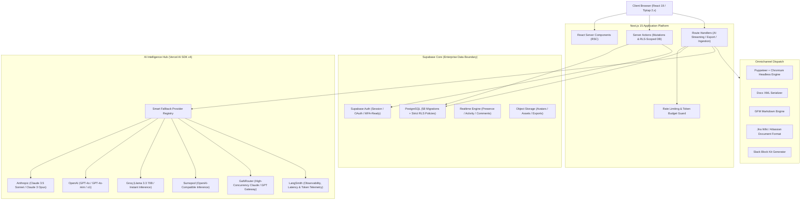

<p align="center">
  
</p>

<h1 align="center">DraftMind</h1>

<p align="center">
  <strong>The Enterprise AI-Powered PRD & Product Lifecycle Platform</strong><br />
  <em>Accelerate product discovery, standardize PRD quality, and align cross-functional engineering teams with enterprise-grade AI orchestration.</em>
</p>

<p align="center">
  <a href="https://nextjs.org/"></a>
  <a href="https://www.typescriptlang.org/"></a>
  <a href="https://react.dev/"></a>
  <a href="https://tailwindcss.com/"></a>
  <a href="https://supabase.com/"></a>
  <a href="https://tiptap.dev/"></a>
  <a href="https://sdk.vercel.ai/"></a>
  
</p>

---

## 📑 Table of Contents

- [Executive Summary](#-executive-summary)
- [Enterprise B2B Architecture](#-enterprise-b2b-architecture)
- [Visual Interface Tour](#-visual-interface-tour)
- [Core Platform Capabilities](#-core-platform-capabilities)
  - [1. Intelligent PRD Lifecycle & Kanban](#1-intelligent-prd-lifecycle--kanban)
  - [2. Multi-Model AI Orchestration Engine](#2-multi-model-ai-orchestration-engine)
  - [3. Purpose-Built Block Editor & Co-Pilot](#3-purpose-built-block-editor--co-pilot)
  - [4. Real-time Collaboration & Workspace Isolation](#4-real-time-collaboration--workspace-isolation)
  - [5. Omnichannel Export Ecosystem](#5-omnichannel-export-ecosystem)
  - [6. Super Admin & Operational Governance](#6-super-admin--operational-governance)
- [Technical Architecture & Stack](#-technical-architecture--stack)
- [Database & Security Governance](#-database--security-governance)
- [Prerequisites & System Requirements](#-prerequisites--system-requirements)
- [Local Quickstart & Setup](#-local-quickstart--setup)
- [Demo Credentials](#-demo-credentials)
- [Environment Configuration](#-environment-configuration)
- [Self-Hosting & Production Deployment](#-self-hosting--production-deployment)
  - [Docker & Containerized Stack (VPS)](#docker--containerized-stack-vps)
  - [Serverless Deployment (Vercel)](#serverless-deployment-vercel)
  - [Database Migrations in Production](#database-migrations-in-production)
- [Testing & Quality Assurance](#-testing--quality-assurance)
- [Project Documentation Matrix](#-project-documentation-matrix)
- [Contributing](#-contributing)
- [License](#-license)

---

## 🏢 Executive Summary

**DraftMind** is an enterprise-grade Product Requirement Document (PRD) intelligence platform built specifically for B2B product organizations, fast-scaling engineering teams, and enterprise digital factories.

Modern product teams lose hundreds of hours bridging the gap between strategic briefs, engineering constraints, and stakeholder sign-offs. DraftMind eliminates this friction by unifying:

1. **Structured Document Generation**: Context-aware AI synthesis that turns raw ideas and bulleted notes into complete, structured, compliance-ready PRDs in seconds.
2. **Deterministic Quality Scoring**: Automated heuristic and LLM-driven audits grading PRD readability, completeness, technical specificity, and architectural consistency (0–100 Health Score).
3. **Deep Multi-Tenancy & Zero-Trust Isolation**: Native PostgreSQL Row Level Security (RLS) guaranteeing strict data boundary enforcement between workspaces.
4. **Enterprise Observability & Fallback Routing**: Zero vendor lock-in with unified AI adapter routing (Anthropic, OpenAI, Groq, Sumopod, GaNRouter) backed by AES-256-GCM key encryption and LangSmith tracing.

---

## 🏛️ Enterprise B2B Architecture



---

## 🖼️ Visual Interface Tour

### 1. Workspace Home & Activity Dashboard

_Unified feed tracking active PRDs, team member activity, pending reviews, and quick-start actions._


---

### 2. PRD Pipeline & Kanban Board

_9-stage lifecycle management (`Draft` → `In Review` → `Refined` → `Approved` → `Shipped`) for engineering and product alignment._


---

### 3. Rich Block Editor & AI Copilot

_Tiptap block-editor featuring custom PRD extensions, floating slash commands, section visibility, and AI assistant._


---

### 4. AI Quality Audit & Health Scoring (0–100)

_Automated multi-dimensional inspection grading structural completeness, readability, edge-case coverage, and clarity._


---

### 5. Enterprise Template Library

_Pre-built production templates (Feature PRD, Experiment Brief, RFC, Technical Specification, API Contract, etc.)._


---

### 6. Super Admin Overview & Platform Health

_Platform-wide governance for user management, workspace quotas, system health status, and support operations._


---

### 7. AI Provider Telemetry & Cost Controls

_Detailed metrics on AI provider latency, token accounting, error distributions, and LangSmith trace identifiers._


---

## 🚀 Core Platform Capabilities

### 1. Intelligent PRD Lifecycle & Kanban

- **9-Stage Enterprise Lifecycle**: Track document maturity across `draft`, `in_review`, `reviewed`, `refined`, `approved`, `final`, `blocked`, `shipped`, and `archived`.
- **Interactive Kanban Pipeline**: Drag-and-drop workspace visibility giving engineering leads, engineering managers, and CPOs full insight into document progression.
- **Granular Access & Sharing**: Granular public share tokens with TTL/expiry and automatic redaction of internal/confidential sections.
- **Snapshot Versioning & Diffing**: Immutable snapshots recorded on every save milestone with granular side-by-side diff comparison and one-click rollback.

### 2. Multi-Model AI Orchestration Engine

- **Full PRD Generation**: Synthesize comprehensive product specs with personas, user stories, acceptance criteria, metric frameworks, edge cases, and risk matrices.
- **Automated Health Score (0–100)**: Multi-dimensional evaluation checking structural completeness, ambiguity detection, testability, and edge-case coverage.
- **13+ In-Context Assist Actions**: Rewrite, expand, condense, convert text to markdown tables, extract acceptance criteria, add metric formulas, translate, and audit compliance.
- **Section-Level Refinement**: Isolate and re-prompt specific sections with domain-specific guidance without polluting surrounding document state.
- **Dynamic Fallback & Routing**: Automatically route requests across Anthropic, OpenAI, Groq, Sumopod, and GaNRouter based on latency, rate limits, and model availability.

### 3. Purpose-Built Block Editor & Co-Pilot

- **Tiptap 2.x Modular Editor**: Custom block nodes for Objectives, Key Metrics, User Stories (As a / I want / So that), Technical Requirements, and Risk Nodes.
- **Interactive AI Co-Pilot Panel**: Embedded assistant grounded in the document context for live brainstorming, technical critique, and gap analysis.
- **Dual-Trigger Auto-Save**: High-frequency idle triggers (3-second debounced) paired with 5-minute periodic checkpoint commits.
- **Slash Commands & Keyboard Accelerators**: Command-palette navigation (`Cmd/Ctrl + K`) for instant actions and rapid block insertion.

### 4. Real-time Collaboration & Workspace Isolation

- **Multi-Tenant Workspaces**: Complete data isolation enforced at the database level via PostgreSQL Row Level Security (RLS).
- **Inline Comment Threads**: Section-anchored discussions with `@mentions`, resolved/unresolved states, and instant notification dispatch.
- **Live Collab Presence**: Real-time member presence indicators, cursor overlays, and activity heartbeats.
- **17+ Event Notification Center**: Push and in-app alerts covering review assignments, status transitions, comments, workspace invitations, and tickets.
- **Role-Based Access Control (RBAC)**: Enterprise roles (`admin`, `editor`, `commenter`, `viewer`) controlling read, write, export, and delete permissions.

### 5. Omnichannel Export Ecosystem

- **Pixel-Perfect PDF**: Rendered via standalone Headless Chromium using styled print media queries.
- **Microsoft Word (DOCX)**: Standardized corporate format with custom typography and clean table layouts.
- **Jira & Confluence Integration**: Formatted Atlassian Document Format (ADF) / Jira wiki syntax ready for direct ticket import.
- **Slack Block Kit**: Share formatted executive summaries directly to engineering and product channels.
- **GitHub-Flavored Markdown & Clean HTML**: Frictionless handoffs to developer documentation portals.

### 6. Super Admin & Operational Governance

- **Platform Analytics**: Global KPIs covering workspace growth, active users, total PRDs by state, and aggregate throughput.
- **AI Run Telemetry & Cost Control**: Per-call tracking of input/output tokens, latency distributions, failure rates, and LangSmith trace identifiers.
- **Credential Vault**: AES-256-GCM encryption at rest for third-party provider API keys.
- **System Audit & Incident Logging**: Real-time error/warn/info streams with resolution state tracking and JSON export for SOC compliance.
- **Enterprise Ticketing & Announcements**: In-platform support ticketing workflow and broadcast announcement channels.

---

## 🛠️ Technical Architecture & Stack

| Layer                    | Technology                  | Version                | Purpose & Strategic Rationale                                        |
| :----------------------- | :-------------------------- | :--------------------- | :------------------------------------------------------------------- |
| **Framework**            | Next.js (App Router)        | `15.0.4`               | React Server Components, Server Actions, streaming API routes        |
| **Language**             | TypeScript (Strict)         | `5.5.4`                | End-to-end type safety across schemas, actions, and UI               |
| **UI Library**           | React                       | `19.0.0`               | Modern concurrent rendering and Server Actions integration           |
| **Styling**              | Tailwind CSS                | `3.4.17`               | B2B design tokens, dark/light theme, and layout architecture         |
| **Component Primitives** | Radix UI                    | Latest                 | Accessible, unstyled dialogs, popovers, tabs, and tooltips           |
| **State Management**     | Zustand & TanStack Query    | `^4.5.0` / `^5.50.0`   | Zustand for UI state; TanStack Query for server state caching        |
| **Rich-Text Engine**     | Tiptap (ProseMirror Core)   | `^2.27.x`              | Extensible custom nodes, tables, task lists, and mention system      |
| **Database & Auth**      | Supabase (PostgreSQL)       | `^2.45.0`              | Row Level Security (RLS), Realtime triggers, Auth, Storage           |
| **AI Orchestration**     | Vercel AI SDK               | `^4.0.0`               | Multi-provider abstraction, streaming, and structured schema parsing |
| **AI Adapters**          | Anthropic, OpenAI, Groq     | `^1.0.0`               | Direct SDK adapters + OpenAI-compatible gateways (Sumopod/GaNRouter) |
| **Document Rendering**   | Puppeteer Core + Chromium   | `^23.0.0` / `^127.0.0` | High-fidelity PDF document generation                                |
| **DOCX Serialization**   | docx                        | `^8.5.0`               | Word document layout generation                                      |
| **Observability**        | LangSmith                   | `^0.6.0`               | Production AI tracing, token accounting, and evaluation              |
| **Transactional Email**  | Resend                      | `^6.12.2`              | Workspace invitations and notification delivery                      |
| **Validation**           | Zod + React Hook Form       | `^3.23.0` / `^7.52.0`  | Schema validation at runtime and form state handling                 |
| **Testing Suite**        | Vitest + Playwright         | `^2.0.0` / `^1.46.0`   | Unit, smoke, component, and end-to-end testing                       |
| **Deployment Target**    | Docker + Node.js Standalone | `20-alpine`            | Containerized VPS deployment, Vercel, or local environment           |

---

## 🔒 Database & Security Governance

DraftMind enforces **Zero-Trust Multi-Tenancy** directly inside PostgreSQL:

1. **58 Sequential Migrations**: Schema evolution tracked cleanly from initial core tables through audit logging, realtime channels, ticketing, and template libraries.
2. **PostgreSQL Row Level Security (RLS)**: Every single public table (`prds`, `workspaces`, `workspace_members`, `comments`, `notifications`, `templates`, etc.) requires authenticated workspace membership.
3. **Immutable Audit Logs**: Administrative changes, access updates, and system events write to immutable audit tables protected from client modification.
4. **Encrypted Provider Storage**: AI provider keys are stored in encrypted format using AES-256-GCM authenticated encryption.

---

## 📦 Prerequisites & System Requirements

- **Node.js**: `>= 20.11.0` (Use `.nvmrc` with `nvm use`)
- **pnpm**: `>= 9.x` (`npm install -g pnpm`)
- **Docker & Docker Compose**: Required for local Supabase emulator and production VPS deployment
- **Supabase CLI**: Required for local database management (`brew install supabase/tap/supabase` or `npm i -g supabase`)

---

## 💻 Local Quickstart & Setup

### 1. Clone & Install Dependencies

```bash
git clone https://github.com/HakimIqbal/draftmind.git
cd draftmind
nvm use
pnpm install
```

### 2. Configure Environment Variables

```bash
cp .env.example .env.local
```

Generate a secure 32-byte base64 encryption key:

```bash
node -e "console.log(require('crypto').randomBytes(32).toString('base64'))"
```

Paste this into `.env.local` as `ENCRYPTION_KEY`.

### 3. Initialize Local Database Stack

```bash
# Start local Supabase Docker containers
pnpm db:start

# Execute all 58 database migrations and apply seed dataset
pnpm db:reset
```

Copy the generated `anon key` and `service_role key` from the terminal output into `.env.local`.

### 4. Launch Development Environment

```bash
pnpm dev
```

Navigate to [http://localhost:3000](http://localhost:3000) in your browser.

---

## 🔑 Demo Credentials

After running `pnpm db:reset`, the following test accounts are pre-seeded:

| Email Account          | Password    | Role & Scope        | Description                                                      |
| :--------------------- | :---------- | :------------------ | :--------------------------------------------------------------- |
| `admin@draftmind.com`  | `admin1234` | **Super Admin**     | Full platform access, provider config, telemetry, system logs    |
| `hakim@draftmind.com`  | `user1234`  | **Workspace Admin** | Primary workspace owner with edit, invite, and management rights |
| `maya@draftmind.com`   | `user1234`  | **Editor**          | Core team member with write, review, and export rights           |
| `rizky@draftmind.com`  | `user1234`  | **Editor**          | Product designer/editor                                          |
| `sari@draftmind.com`   | `user1234`  | **Commenter**       | Stakeholder role (review, comment, approve)                      |
| `daniel@draftmind.com` | `user1234`  | **Viewer**          | Read-only stakeholder access                                     |

---

## ⚙️ Environment Configuration

| Variable                        |      Tier       | Required | Description                                                                   |
| :------------------------------ | :-------------: | :------: | :---------------------------------------------------------------------------- |
| `NEXT_PUBLIC_SUPABASE_URL`      | Client / Server |    ✅    | Supabase API endpoint (`http://127.0.0.1:54321` locally)                      |
| `NEXT_PUBLIC_SUPABASE_ANON_KEY` | Client / Server |    ✅    | Supabase anonymous public API key                                             |
| `SUPABASE_SERVICE_ROLE_KEY`     |   Server Only   |    ✅    | Privileged service role key (bypasses RLS for system jobs)                    |
| `DATABASE_URL`                  |   Server Only   |    ✅    | PostgreSQL connection string with transaction pooler support                  |
| `NEXT_PUBLIC_APP_URL`           | Client / Server |    ✅    | Base public URL (e.g. `http://localhost:3000` or `https://app.draftmind.com`) |
| `ENCRYPTION_KEY`                |   Server Only   |    ✅    | 32-byte base64 key for AES-256-GCM encryption of AI credentials               |
| `DEPLOYMENT_TARGET`             |   Server Only   |    -     | Target environment selector: `local`, `vercel`, or `vps`                      |
| `SKIP_ENV_VALIDATION`           |   Build Time    |    -     | Set `true` during CI/Docker multi-stage compilation only                      |
| `RESEND_API_KEY`                |   Server Only   |    -     | Resend API key for transactional emails & member invites                      |
| `EMAIL_FROM`                    |   Server Only   |    -     | Configured sender address (e.g. `DraftMind <noreply@draftmind.app>`)          |
| `LANGCHAIN_API_KEY`             |   Server Only   |    -     | LangSmith API key for real-time AI tracing                                    |
| `LANGCHAIN_PROJECT`             |   Server Only   |    -     | LangSmith project name (default: `draftmind`)                                 |
| `LANGCHAIN_TRACING_V2`          |   Server Only   |    -     | Set `true` to enable deep AI trace streaming                                  |
| `SUPABASE_WEBHOOK_SECRET`       |   Server Only   |    -     | HMAC-SHA256 secret for verifying inbound Supabase webhooks                    |

---

## 🌐 Self-Hosting & Production Deployment

### Docker & Containerized Stack (VPS)

DraftMind includes an optimized multi-stage Docker build utilizing Next.js standalone output and headless Chromium runtime:

```bash
# 1. Build optimized container image
docker build -t draftmind:latest .

# 2. Launch production container with environment file
docker run -d \
  --name draftmind \
  --restart unless-stopped \
  -p 3000:3000 \
  --env-file .env.production \
  draftmind:latest
```

Alternatively, deploy using Docker Compose:

```bash
docker compose up -d
```

### Serverless Deployment (Vercel)

1. Push your repository to GitHub / GitLab.
2. Import project into Vercel.
3. Configure all **Required Environment Variables** in Project Settings.
4. Set `DEPLOYMENT_TARGET=vercel`.
5. Deploy.

### Database Migrations in Production

Apply all 58 database migrations to your remote Supabase instance:

```bash
# Link local CLI to remote Supabase project
supabase link --project-ref <your-project-ref>

# Push migrations to production database
supabase db push
```

---

## 🧪 Testing & Quality Assurance

DraftMind enforces strict quality gates on all commits and PRs:

```bash
# Run TypeScript compilation check
pnpm typecheck

# Run ESLint validation
pnpm lint

# Format codebase with Prettier & Tailwind plugin
pnpm format

# Execute unit and smoke test suites (Vitest)
pnpm test

# Run end-to-end integration tests (Playwright)
pnpm test:e2e
```

### CI/CD Workflows (`.github/workflows/`)

- **`ci.yml`**: Runs on every pull request targeting `main` (`typecheck → lint → vitest`).
- **`e2e.yml`**: Runs on push to `main` executing full Playwright browser flows.

---

## 📚 Project Documentation Matrix

Deep-dive architectural specifications, security reports, and API references:

| Document                                                     | Primary Focus                                                        |
| :----------------------------------------------------------- | :------------------------------------------------------------------- |
| 📖 [Architecture Specification](docs/ARCHITECTURE.md)        | High-level system design, state layers, and data flow patterns       |
| 🗄️ [Database Architecture & Schema](docs/DATABASE.md)        | Table structures, RLS policies, trigger flows, and index strategies  |
| 📋 [PRD Schema & Content Model](docs/PRD_SCHEMA.md)          | Document node structures, validation rules, and JSON representations |
| 🔌 [API & Server Action Reference](docs/API.md)              | Route handlers, request/response contracts, and mutation actions     |
| 🎨 [Design System & Tokens](docs/DESIGN_SYSTEM.md)           | CSS custom properties, typography scales, and UI component standards |
| 🚀 [Enterprise Deployment Guide](docs/DEPLOYMENT.md)         | Bare-metal, Docker, VPS, and Cloud hosting runbooks                  |
| 👥 [User Walkthrough Guide](docs/USER_GUIDE.md)              | End-user PRD authoring, AI assist shortcuts, and collaboration guide |
| 👑 [Admin & Operations Guide](docs/WORKFLOW_ADMIN.md)        | Provider configuration, user management, and support handling        |
| 🛡️ [Security Audit Report](docs/SECURITY-REPORT-20260604.md) | Security evaluation, RLS boundary verification, and encryption audit |
| 🤝 [Contributing Guidelines](docs/CONTRIBUTING.md)           | Branching strategy, commit conventions, and development hygiene      |

---

## 🤝 Contributing

Contributions are welcome. Please read our [Contributing Guide](docs/CONTRIBUTING.md) before submitting pull requests.

1. Fork the project repository.
2. Create your feature branch (`git checkout -b feature/enterprise-sso`).
3. Commit your changes (`git commit -m 'feat(auth): add SAML SSO integration'`).
4. Push to your branch (`git push origin feature/enterprise-sso`).
5. Open a Pull Request.

---

## 📄 License

Distributed under the MIT License. See `LICENSE` for more information.

<p align="center">
  <sub>Built with precision by <a href="https://github.com/HakimIqbal">Hakim Iqbal</a> and contributors.</sub>
</p>
