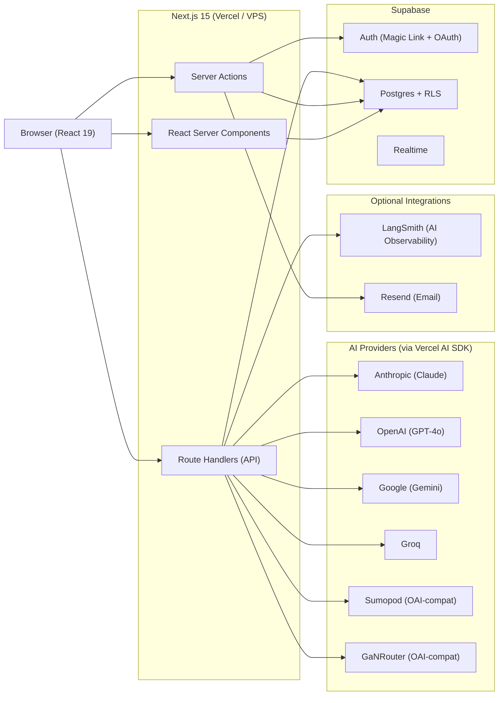
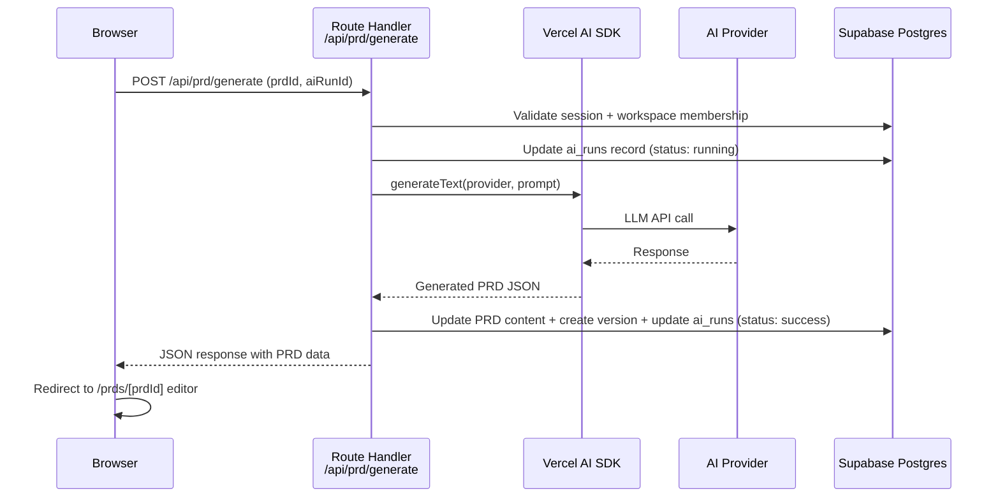

# Architecture

DraftMind is an AI-powered PRD generator built with Next.js 15 (App Router), Supabase, and the Vercel AI SDK. This document describes the high-level architecture, layers, and key patterns.

---

## System Overview



---

## Tech Stack

| Category      | Technology                                         |
| ------------- | -------------------------------------------------- |
| Framework     | Next.js 15 (App Router, RSC, Server Actions)       |
| UI            | React 19, Tailwind CSS, custom design tokens       |
| Editor        | Tiptap 2.x (`@tiptap/core` ^2.27, extensions ^2.6) |
| State         | Zustand (client), TanStack Query (server state)    |
| Database      | Supabase Postgres + RLS                            |
| Auth          | Supabase Auth (email/password + OAuth)             |
| AI            | Vercel AI SDK v4, 6 provider adapters              |
| Observability | LangSmith (optional)                               |
| Email         | Resend (optional)                                  |
| Deployment    | Vercel (serverless) or VPS (Docker standalone)     |
| Command UX    | cmdk (command palette)                             |

---

## Architectural Layers

### 1. Presentation Layer

- **React Server Components (RSC)** by default for all pages and layouts.
- **Client Components** (`'use client'`) only where interactivity is required: editor, forms, tweaks panel, real-time UI.
- **Tiptap 2.x** rich-text editor with custom extensions for PRD sections.
- **Zustand** stores for ephemeral client state (tweaks, editor panel state, command palette).
- **TanStack Query** for server-state caching and optimistic updates on the client.

### 2. API Layer

- **Server Actions** for all mutations (CRUD for PRDs, comments, notifications, workspace, profile). Colocated in `actions.ts` files next to the pages that use them.
- **Route Handlers** (`route.ts`) for AI endpoints, export, provider management, webhooks, and versioning.
- All endpoints validate input with **Zod** schemas.
- AI endpoints use **Vercel AI SDK** `generateText` for structured AI output.

### 3. Data Layer

- **Supabase Postgres** as the single database.
- **Row Level Security (RLS)** on every public table, enforcing workspace membership and role-based access.
- Supabase Auth handles email/password login and OAuth.
- Provider API keys are encrypted at rest (AES-256-GCM) and never exposed to the client.

### 4. AI Layer

- **Vercel AI SDK v4** with 6 provider adapters: Anthropic, OpenAI, Google, Groq, Sumopod (OpenAI-compatible), GaNRouter (OpenAI-compatible).
- Provider registry in `src/lib/ai/providers.ts` resolves workspace-configured providers at runtime. Supports priority-based fallback.
- Prompt templates in `src/lib/ai/prompts/` for: full PRD generation, section refinement, AI review, inline suggestions, and copilot chat.
- Every AI invocation is logged to the `ai_runs` table with token counts, duration, and cost estimation.
- Optional **LangSmith** integration for AI observability and tracing.

---

## Key Patterns

| Pattern                             | Description                                                                                                                       |
| ----------------------------------- | --------------------------------------------------------------------------------------------------------------------------------- |
| **RSC by default**                  | Pages are server-rendered. Client components are opt-in with `'use client'`.                                                      |
| **Server Actions for mutations**    | All data writes go through Server Actions with `revalidatePath`/`revalidateTag` for cache invalidation.                           |
| **Zustand for client state**        | UI-only state (theme, panel collapse, editor focus) lives in Zustand stores persisted to localStorage.                            |
| **TanStack Query for server state** | Data fetched on the client is cached and synchronized via React Query with optimistic updates.                                    |
| **RLS everywhere**                  | Every database table has RLS policies. The app never bypasses RLS except via service role on the server for audit logging.        |
| **Env-validated startup**           | `@t3-oss/env-nextjs` validates all environment variables at build time. Deployment target (`local`, `vercel`, `vps`) is explicit. |
| **Triple deployment**               | The same codebase deploys to local dev (Supabase CLI), Vercel (serverless), and VPS (Docker standalone).                          |

---

## Request Flow Example: Generate PRD



---

## Folder Structure

```
src/
  app/                    Next.js App Router
    (admin)/              Super admin panel
      admin/
        activity/         Activity log
        ai-runs/          AI run history
        analytics/        Analytics dashboard
        announcements/    System announcements
        prds/             PRD management
        providers/        Provider management
        settings/         System settings
        system-logs/      System error logs
        templates/        Template management
        users/            User management
        workspaces/       Workspace management
    (auth)/               Authentication
      login/              Login page
    (app)/                Authenticated app (sidebar shell)
      dashboard/          Home dashboard
      prds/               PRD list, editor, versions, export, AI review
        [prdId]/          PRD editor + sub-pages
        new/              Generate form
        pipeline/         Kanban pipeline view
      ai-runs/            User's AI run history
      search/             Global search
      templates/          Template browser
      settings/           User settings (profile, providers, notifications, preferences, api-keys, audit)
      workspace/          Workspace management (members, settings, activity, invites)
    api/                  Route handlers
      auth/callback/      OAuth callback
      log/                Client-side error logging
      prd/                PRD endpoints (generate, refine, ai-review, ai-suggest, export, versions, share)
      providers/          Provider CRUD + test
      webhooks/supabase/  Auth event hooks
      workspace/          Members + invite
    share/[shareToken]/   Public PRD share view
    privacy/              Privacy policy
    terms/                Terms of service
  components/             UI components
    admin/                Admin shell & tables
    audit/                Activity & AI run tables
    auth/                 Login form
    dashboard/            Activity feed, PRD list, pipeline board
    editor/               Tiptap editor, AI copilot, AI assist, comments, outline, history
    export/               Export UI
    generate/             PRD generation form & loading
    icons/                Custom icon components
    layout/               App shell, sidebar, topbar, workspace switcher
    overlays/             Command palette, notifications inbox
    refine/               Section refinement UI
    settings/             Profile form
    share/                Public share view
    templates/            Template browser
    tweaks/               Tweaks panel UI
    ui/                   21 primitives (avatar, button, card, checkbox, chip, dialog, dropdown-menu, input, kbd, pill, popover, progress-bar, progress-ring, radio-card, select, separator, sigil, skeleton, tabs, textarea, tooltip)
    version/              Version history
    workspace/            Invite modal, members table, workspace hub
  hooks/                  Custom React hooks (6 files)
  lib/                    Business logic
    ai/                   AI client, providers, prompts, schema, streaming, LangSmith
    auth/                 Permission helpers
    db/                   Database queries (activity, dashboard, notification, prd, provider, version, workspace)
    editor/               Tiptap extensions
    email/                Resend email sender + templates
    export/               Export engines (pdf, docx, markdown, html, slack, jira)
    logging/              System error logging
    prd/                  PRD schema, health score, readability, tiptap-content, markdown
    supabase/             Supabase client (server + browser)
    tweaks/               Design tokens
    utils/                Utilities (cn, crypto, format, id, slug, rate-limit)
  stores/                 Zustand stores (command-palette, editor, tweaks)
  styles/                 CSS (tokens, fonts, editor)
  types/                  TypeScript types (activity, database, prd, provider, workspace)
scripts/                  Seed data, type generation
supabase/                 17 migration files + config
tests/                    Unit, integration, e2e, smoke tests
```
