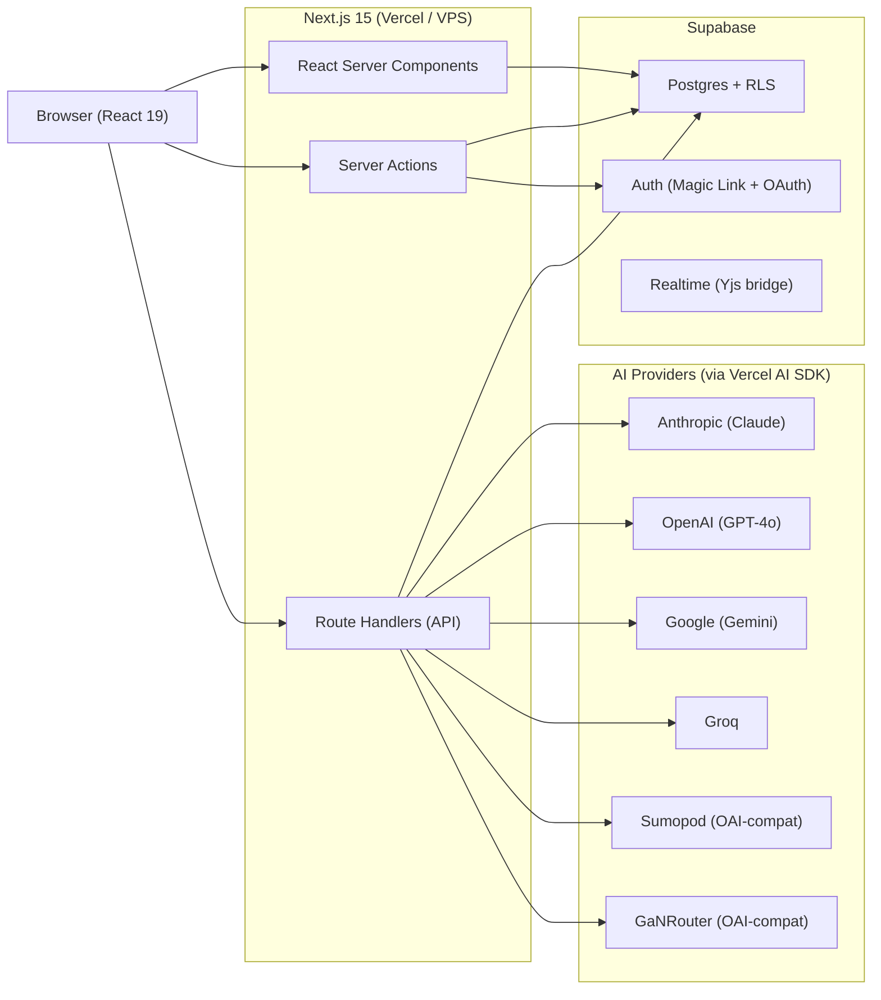
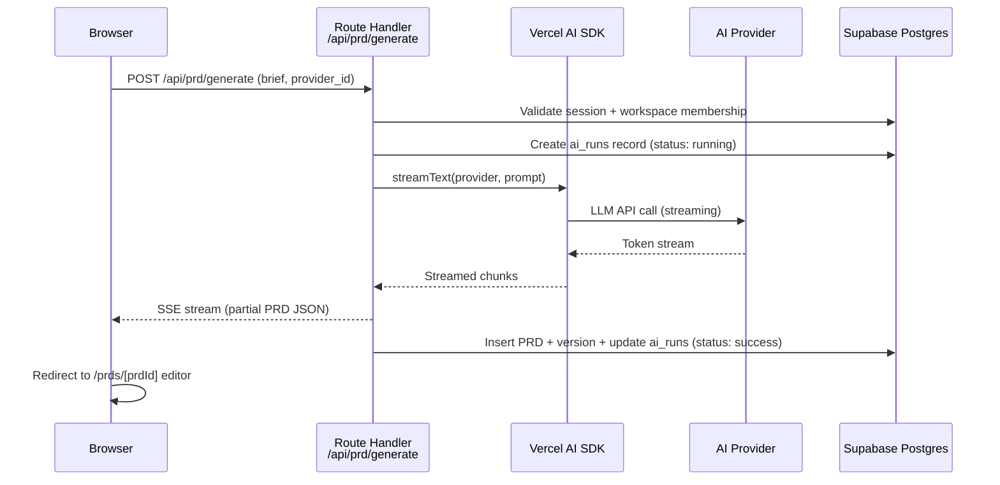

# Architecture

DraftMind is an AI-powered PRD generator built with Next.js 15 (App Router), Supabase, and the Vercel AI SDK. This document describes the high-level architecture, layers, and key patterns.

---

## System Overview



---

## Architectural Layers

### 1. Presentation Layer

- **React Server Components (RSC)** by default for all pages and layouts.
- **Client Components** (`'use client'`) only where interactivity is required: editor, forms, tweaks panel, real-time UI.
- **Tiptap 2.6** rich-text editor with Yjs CRDT for collaborative editing.
- **Zustand** stores for ephemeral client state (tweaks, editor panel state, command palette).
- **TanStack Query** for server-state caching and optimistic updates on the client.
- **nuqs** for URL-synced state (filters, active tabs).

### 2. API Layer

- **Server Actions** for all mutations (CRUD for PRDs, comments, notifications). Colocated in `actions.ts` files next to the pages that use them.
- **Route Handlers** (`route.ts`) for AI streaming endpoints, export, provider management, webhooks, and versioning.
- All endpoints validate input with **Zod** schemas.
- AI endpoints use **Vercel AI SDK** `streamText` for Server-Sent Events streaming.

### 3. Data Layer

- **Supabase Postgres** as the single database.
- **Row Level Security (RLS)** on every public table, enforcing workspace membership and role-based access.
- **Drizzle ORM** for type-safe queries on top of Supabase Postgres.
- Supabase Auth handles magic link login and Google OAuth.
- Provider API keys are encrypted at rest (AES-256-GCM) and never exposed to the client.

### 4. AI Layer

- **Vercel AI SDK v4** with 6 provider adapters: Anthropic, OpenAI, Google, Groq, Sumopod (OpenAI-compatible), GaNRouter (OpenAI-compatible).
- Provider registry in `src/lib/ai/providers.ts` resolves workspace-configured providers at runtime.
- Prompt templates in `src/lib/ai/prompts/` for: full PRD generation, section refinement, AI review, and inline suggestions.
- Every AI invocation is logged to the `ai_runs` table with token counts, duration, and cost estimation.

---

## Key Patterns

| Pattern                             | Description                                                                                                                       |
| ----------------------------------- | --------------------------------------------------------------------------------------------------------------------------------- |
| **RSC by default**                  | Pages are server-rendered. Client components are opt-in with `'use client'`.                                                      |
| **Server Actions for mutations**    | All data writes go through Server Actions with `revalidatePath`/`revalidateTag` for cache invalidation.                           |
| **Streaming for AI**                | AI endpoints stream responses via SSE using Vercel AI SDK `streamText`. Client subscribes via custom hooks.                       |
| **Zustand for client state**        | UI-only state (theme, panel collapse, editor focus) lives in Zustand stores persisted to localStorage.                            |
| **TanStack Query for server state** | Data fetched on the client is cached and synchronized via React Query with optimistic updates.                                    |
| **RLS everywhere**                  | Every database table has RLS policies. The app never bypasses RLS except via service role on the server for audit logging.        |
| **Env-validated startup**           | `@t3-oss/env-nextjs` validates all environment variables at build time. Deployment target (`local`, `vercel`, `vps`) is explicit. |
| **Triple deployment**               | The same codebase deploys to local dev (Supabase CLI), Vercel (serverless), and VPS (Docker standalone).                          |

---

## Request Flow Example: Generate PRD



---

## Folder Structure (Summary)

```
src/
  app/              Next.js App Router (pages, layouts, API routes)
    (marketing)/    Public landing (redirect to login)
    (auth)/         Login + onboarding flow
    (app)/          Authenticated app (sidebar shell)
    api/            Route handlers (AI, export, providers, webhooks)
  components/       UI primitives, layout, editor, dashboard, etc.
  lib/              Business logic (supabase, db, ai, prd, export, auth)
  hooks/            Custom React hooks
  stores/           Zustand stores
  types/            TypeScript type definitions
  styles/           CSS tokens, fonts, editor styles
supabase/           Migrations, seed data, config
tests/              Unit, integration, e2e tests
```

See the full folder structure in the Master Brief (Section 3).
