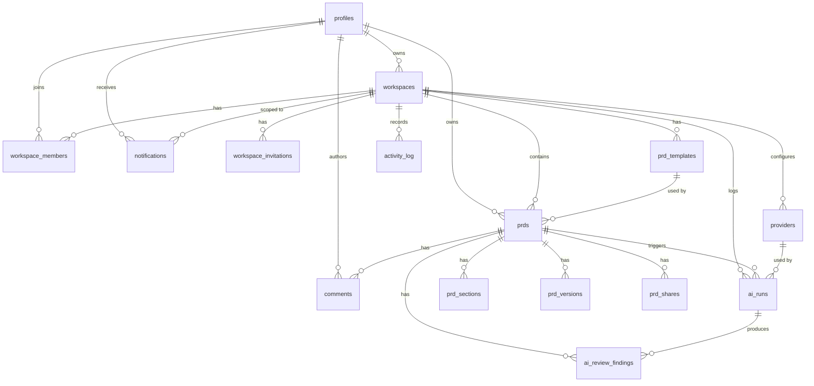

# Database Schema

DraftMind uses Supabase Postgres with Row Level Security (RLS) on all tables. This document covers the full schema, ERD, RLS policies, helper functions, and triggers.

---

## Entity Relationship Diagram

---

## Tables (15 Total)

### Identity and Workspace

#### `profiles`

Extends `auth.users`. Created automatically on signup via trigger.

| Column                  | Type        | Notes                                         |
| ----------------------- | ----------- | --------------------------------------------- |
| id                      | uuid PK     | References `auth.users(id)` ON DELETE CASCADE |
| email                   | text UNIQUE |                                               |
| full_name               | text        |                                               |
| avatar_initials         | text        | e.g. "MR"                                     |
| avatar_color_seed       | text        | Deterministic color                           |
| role_self_reported      | text        | "Product Manager", "Business Analyst", etc.   |
| experience_level        | text        | "Beginner" / "Intermediate" / "Expert"        |
| primary_use_cases       | text[]      | ["Feature PRD", "RFC", ...]                   |
| default_locale          | text        | 'en' or 'id'                                  |
| onboarding_completed_at | timestamptz |                                               |
| created_at              | timestamptz |                                               |
| updated_at              | timestamptz |                                               |

#### `workspaces`

| Column          | Type        | Notes                                                  |
| --------------- | ----------- | ------------------------------------------------------ |
| id              | uuid PK     |                                                        |
| name            | text        |                                                        |
| slug            | text UNIQUE |                                                        |
| icon_pattern    | text        | 'circle' / 'square' / 'rounded' / 'hexagon' / 'custom' |
| icon_custom_url | text        |                                                        |
| is_private      | boolean     | Default true                                           |
| industry        | text        |                                                        |
| team_size       | text        | "Just me" / "2-10" / "11-50" / "51-200" / "200+"       |
| owner_id        | uuid FK     | References `profiles(id)`                              |
| created_at      | timestamptz |                                                        |
| updated_at      | timestamptz |                                                        |

#### `workspace_members`

| Column         | Type           | Notes                                       |
| -------------- | -------------- | ------------------------------------------- |
| workspace_id   | uuid PK, FK    |                                             |
| user_id        | uuid PK, FK    |                                             |
| role           | workspace_role | 'admin' / 'editor' / 'commenter' / 'viewer' |
| joined_at      | timestamptz    |                                             |
| last_active_at | timestamptz    |                                             |

#### `workspace_invitations`

| Column       | Type           | Notes |
| ------------ | -------------- | ----- |
| id           | uuid PK        |       |
| workspace_id | uuid FK        |       |
| email        | text           |       |
| role         | workspace_role |       |
| invited_by   | uuid FK        |       |
| token        | text UNIQUE    |       |
| expires_at   | timestamptz    |       |
| accepted_at  | timestamptz    |       |
| revoked_at   | timestamptz    |       |
| created_at   | timestamptz    |       |

### PRD and Editor

#### `prd_templates`

| Column       | Type        | Notes                                                                  |
| ------------ | ----------- | ---------------------------------------------------------------------- |
| id           | uuid PK     |                                                                        |
| workspace_id | uuid FK     | Nullable = global built-in                                             |
| name         | text        |                                                                        |
| description  | text        |                                                                        |
| category     | text        | 'feature' / 'experiment' / 'rfc' / 'one-pager' / 'research' / 'custom' |
| structure    | jsonb       | 14-section schema customized                                           |
| use_count    | integer     |                                                                        |
| is_built_in  | boolean     |                                                                        |
| created_at   | timestamptz |                                                                        |

#### `prds`

| Column            | Type        | Notes                                                                                                      |
| ----------------- | ----------- | ---------------------------------------------------------------------------------------------------------- |
| id                | uuid PK     |                                                                                                            |
| workspace_id      | uuid FK     |                                                                                                            |
| owner_id          | uuid FK     |                                                                                                            |
| template_id       | uuid FK     | Nullable                                                                                                   |
| title             | text        |                                                                                                            |
| project_tag       | text        |                                                                                                            |
| status            | prd_status  | 'draft' / 'in_review' / 'reviewed' / 'refined' / 'final' / 'blocked' / 'approved' / 'shipped' / 'archived' |
| content           | jsonb       | 14-section JSON                                                                                            |
| tiptap_content    | jsonb       | Tiptap editor state mirror                                                                                 |
| health_score      | integer     | 0-100, computed                                                                                            |
| health_breakdown  | jsonb       | {completeness, specificity, structural, consistency}                                                       |
| word_count        | integer     |                                                                                                            |
| read_time_minutes | integer     |                                                                                                            |
| readability_score | text        | 'Excellent' / 'Good' / 'Fair' / 'Poor'                                                                     |
| current_version   | integer     |                                                                                                            |
| is_pinned         | boolean     |                                                                                                            |
| metadata          | jsonb       | start_date, end_date, stakeholders, etc.                                                                   |
| archived_at       | timestamptz |                                                                                                            |
| created_at        | timestamptz |                                                                                                            |
| updated_at        | timestamptz |                                                                                                            |

**Indexes:** `idx_prds_workspace_status`, `idx_prds_owner`, `idx_prds_updated`

#### `prd_sections`

| Column       | Type        | Notes                      |
| ------------ | ----------- | -------------------------- |
| prd_id       | uuid PK, FK |                            |
| section_key  | text PK     | One of the 14 section keys |
| content      | jsonb       |                            |
| health_score | integer     |                            |
| word_count   | integer     |                            |
| updated_at   | timestamptz |                            |

#### `prd_versions`

| Column             | Type        | Notes                                                |
| ------------------ | ----------- | ---------------------------------------------------- |
| id                 | uuid PK     |                                                      |
| prd_id             | uuid FK     |                                                      |
| version_number     | integer     | UNIQUE with prd_id                                   |
| content            | jsonb       | Full snapshot                                        |
| diff_from_previous | jsonb       | Structured diff                                      |
| change_summary     | text        |                                                      |
| created_by         | uuid FK     |                                                      |
| source             | text        | 'manual' / 'ai_generation' / 'ai_refine' / 'restore' |
| ai_run_id          | uuid        | References ai_runs(id)                               |
| created_at         | timestamptz |                                                      |

#### `comments`

| Column          | Type        | Notes                                |
| --------------- | ----------- | ------------------------------------ |
| id              | uuid PK     |                                      |
| prd_id          | uuid FK     |                                      |
| parent_id       | uuid FK     | Self-referencing for threads         |
| author_id       | uuid FK     |                                      |
| is_ai_generated | boolean     |                                      |
| section_key     | text        | Anchors comment to section           |
| selection_range | jsonb       | {from, to, text} for inline comments |
| body            | text        |                                      |
| reactions       | jsonb       | {"emoji": [user_ids]}                |
| resolved_at     | timestamptz |                                      |
| resolved_by     | uuid FK     |                                      |
| mentions        | uuid[]      | @mention user_ids                    |
| created_at      | timestamptz |                                      |
| updated_at      | timestamptz |                                      |

**Indexes:** `idx_comments_prd` (unresolved only)

#### `prd_shares`

| Column      | Type        | Notes           |
| ----------- | ----------- | --------------- |
| id          | uuid PK     |                 |
| prd_id      | uuid FK     |                 |
| share_token | text UNIQUE | nanoid 16 chars |
| created_by  | uuid FK     |                 |
| expires_at  | timestamptz |                 |
| view_count  | integer     |                 |
| is_active   | boolean     |                 |
| created_at  | timestamptz |                 |

### AI Provider and Runs

#### `providers`

| Column            | Type            | Notes                                                                           |
| ----------------- | --------------- | ------------------------------------------------------------------------------- |
| id                | uuid PK         |                                                                                 |
| workspace_id      | uuid FK         |                                                                                 |
| type              | provider_type   | 'anthropic' / 'openai' / 'gemini' / 'groq' / 'sumopod' / 'ganrouter' / 'custom' |
| display_name      | text            |                                                                                 |
| base_url          | text            | For OpenAI-compatible custom providers                                          |
| api_key_encrypted | text            | Encrypted at rest, server-only                                                  |
| default_model     | text            |                                                                                 |
| available_models  | text[]          |                                                                                 |
| is_default        | boolean         | One default per workspace (unique index)                                        |
| status            | provider_status | 'active' / 'disconnected' / 'error'                                             |
| status_reason     | text            | Error message                                                                   |
| last_used_at      | timestamptz     |                                                                                 |
| created_by        | uuid FK         |                                                                                 |
| created_at        | timestamptz     |                                                                                 |
| updated_at        | timestamptz     |                                                                                 |

**Indexes:** `idx_providers_one_default` (unique partial index)

#### `ai_runs`

| Column            | Type          | Notes                                                                                                  |
| ----------------- | ------------- | ------------------------------------------------------------------------------------------------------ |
| id                | uuid PK       |                                                                                                        |
| workspace_id      | uuid FK       |                                                                                                        |
| prd_id            | uuid FK       | Nullable                                                                                               |
| user_id           | uuid FK       |                                                                                                        |
| provider_id       | uuid FK       |                                                                                                        |
| type              | ai_run_type   | 'generate_prd' / 'refine_section' / 'regenerate_prd' / 'ai_review' / 'inline_suggest' / 'quick_action' |
| status            | ai_run_status | 'queued' / 'running' / 'success' / 'error' / 'cancelled'                                               |
| model_used        | text          |                                                                                                        |
| prompt_tokens     | integer       |                                                                                                        |
| completion_tokens | integer       |                                                                                                        |
| total_tokens      | integer       |                                                                                                        |
| duration_ms       | integer       |                                                                                                        |
| cost_credits      | integer       | Internal credit estimation                                                                             |
| input_payload     | jsonb         |                                                                                                        |
| output_payload    | jsonb         |                                                                                                        |
| error_message     | text          |                                                                                                        |
| metadata          | jsonb         |                                                                                                        |
| created_at        | timestamptz   |                                                                                                        |
| completed_at      | timestamptz   |                                                                                                        |

**Indexes:** `idx_ai_runs_workspace`, `idx_ai_runs_prd`

#### `ai_review_findings`

| Column         | Type             | Notes                     |
| -------------- | ---------------- | ------------------------- |
| id             | uuid PK          |                           |
| ai_run_id      | uuid FK          |                           |
| prd_id         | uuid FK          |                           |
| severity       | finding_severity | 'high' / 'medium' / 'low' |
| section_key    | text             |                           |
| title          | text             |                           |
| description    | text             |                           |
| suggested_fix  | text             |                           |
| fix_applied_at | timestamptz      |                           |
| fix_applied_by | uuid FK          |                           |
| dismissed_at   | timestamptz      |                           |
| dismissed_by   | uuid FK          |                           |
| created_at     | timestamptz      |                           |

### Activity and Notifications

#### `activity_log`

| Column        | Type          | Notes                                                   |
| ------------- | ------------- | ------------------------------------------------------- |
| id            | uuid PK       |                                                         |
| workspace_id  | uuid FK       |                                                         |
| actor_id      | uuid FK       |                                                         |
| type          | activity_type | See enum below                                          |
| resource_type | text          | 'prd' / 'comment' / 'member' / 'provider' / 'workspace' |
| resource_id   | uuid          |                                                         |
| metadata      | jsonb         |                                                         |
| created_at    | timestamptz   |                                                         |

**activity_type enum values:** `prd_created`, `prd_edited`, `prd_status_changed`, `prd_archived`, `prd_exported`, `comment_added`, `comment_resolved`, `review_requested`, `review_approved`, `review_rejected`, `ai_generation_completed`, `ai_review_completed`, `ai_refinement_applied`, `member_invited`, `member_joined`, `member_role_changed`, `member_removed`, `workspace_created`, `workspace_settings_changed`, `provider_added`, `provider_disconnected`, `login`, `logout`, `public_share_created`, `public_share_viewed`

**Indexes:** `idx_activity_workspace_time`, `idx_activity_actor`

#### `notifications`

| Column        | Type              | Notes                                                                                                                                 |
| ------------- | ----------------- | ------------------------------------------------------------------------------------------------------------------------------------- |
| id            | uuid PK           |                                                                                                                                       |
| recipient_id  | uuid FK           |                                                                                                                                       |
| workspace_id  | uuid FK           |                                                                                                                                       |
| type          | notification_type | 'mention' / 'review_request' / 'approval_needed' / 'comment_reply' / 'ai_suggestion_ready' / 'integration_event' / 'workspace_invite' |
| title         | text              |                                                                                                                                       |
| body          | text              |                                                                                                                                       |
| resource_type | text              |                                                                                                                                       |
| resource_id   | uuid              |                                                                                                                                       |
| action_url    | text              |                                                                                                                                       |
| read_at       | timestamptz       |                                                                                                                                       |
| created_at    | timestamptz       |                                                                                                                                       |

**Indexes:** `idx_notifications_recipient_unread`

---

## RLS Policy Summary

| Table                 | Policy Name                        | Operation              | Who Can Access                                  |
| --------------------- | ---------------------------------- | ---------------------- | ----------------------------------------------- |
| profiles              | `profiles_select_workspace_member` | SELECT                 | Users in the same workspace                     |
| profiles              | `profiles_update_own`              | UPDATE                 | Own profile only                                |
| workspaces            | `workspaces_select_member`         | SELECT                 | Workspace members                               |
| workspaces            | `workspaces_update_admin`          | UPDATE, DELETE         | Workspace admins only                           |
| workspace_members     | `members_select_member`            | SELECT                 | Workspace members                               |
| workspace_members     | `members_write_admin`              | INSERT, UPDATE, DELETE | Workspace admins only                           |
| workspace_invitations | `invitations_select_admin`         | SELECT                 | Workspace admins                                |
| workspace_invitations | `invitations_write_admin`          | INSERT, UPDATE         | Workspace admins only                           |
| prd_templates         | `templates_select_member`          | SELECT                 | Workspace members + global built-in             |
| prd_templates         | `templates_write_admin_editor`     | INSERT, UPDATE, DELETE | Admin or editor role                            |
| prds                  | `prds_select_member`               | SELECT                 | Workspace members                               |
| prds                  | `prds_write_admin_editor`          | INSERT, UPDATE, DELETE | Admin or editor role                            |
| prd_sections          | `sections_select_member`           | SELECT                 | Workspace members                               |
| prd_sections          | `sections_write_admin_editor`      | INSERT, UPDATE         | Admin or editor role                            |
| prd_versions          | `versions_select_member`           | SELECT                 | Workspace members                               |
| prd_versions          | `versions_insert_admin_editor`     | INSERT                 | Admin or editor role                            |
| comments              | `comments_select_member`           | SELECT                 | Workspace members                               |
| comments              | `comments_insert_commenter_plus`   | INSERT                 | Admin, editor, or commenter role                |
| comments              | `comments_update_own`              | UPDATE                 | Comment author only                             |
| comments              | `comments_delete_own_or_admin`     | DELETE                 | Comment author or workspace admin               |
| prd_shares            | `shares_select_member`             | SELECT                 | Workspace members                               |
| prd_shares            | `shares_write_admin_editor`        | INSERT, UPDATE         | Admin or editor role                            |
| prd_shares            | `shares_public_read`               | SELECT                 | Anyone with valid share_token (bypasses RLS)    |
| providers             | `providers_select_admin`           | SELECT                 | Workspace admins only                           |
| providers             | `providers_write_admin`            | INSERT, UPDATE, DELETE | Workspace admins only                           |
| ai_runs               | `ai_runs_select_member`            | SELECT                 | Workspace members                               |
| ai_runs               | `ai_runs_insert_service`           | INSERT, UPDATE         | Service role only (server actions)              |
| ai_review_findings    | `findings_select_member`           | SELECT                 | Workspace members                               |
| ai_review_findings    | `findings_write_service`           | INSERT, UPDATE         | Service role only                               |
| activity_log          | `activity_select_member`           | SELECT                 | Workspace members                               |
| activity_log          | `activity_insert_service`          | INSERT                 | Service role only (immutable, no UPDATE/DELETE) |
| notifications         | `notifications_select_own`         | SELECT                 | Recipient only                                  |
| notifications         | `notifications_update_own`         | UPDATE                 | Recipient only (mark as read)                   |

---

## Helper Functions

### `has_workspace_role(workspace_id uuid, required_role workspace_role)`

Returns `boolean`. Checks whether the current authenticated user (`auth.uid()`) is a member of the given workspace with a role at or above the required level. Role hierarchy: admin > editor > commenter > viewer.

### `handle_new_user()`

Trigger function executed on `auth.users` INSERT. Creates a corresponding row in `public.profiles` with email extracted from auth metadata.

### `update_updated_at()`

Generic trigger function that sets `updated_at = now()` on any UPDATE operation.

---

## Triggers

| Trigger Name              | Table          | Event         | Function              |
| ------------------------- | -------------- | ------------- | --------------------- |
| `on_auth_user_created`    | `auth.users`   | AFTER INSERT  | `handle_new_user()`   |
| `profiles_updated_at`     | `profiles`     | BEFORE UPDATE | `update_updated_at()` |
| `workspaces_updated_at`   | `workspaces`   | BEFORE UPDATE | `update_updated_at()` |
| `prds_updated_at`         | `prds`         | BEFORE UPDATE | `update_updated_at()` |
| `prd_sections_updated_at` | `prd_sections` | BEFORE UPDATE | `update_updated_at()` |
| `comments_updated_at`     | `comments`     | BEFORE UPDATE | `update_updated_at()` |
| `providers_updated_at`    | `providers`    | BEFORE UPDATE | `update_updated_at()` |

---

## Custom Enums

| Enum                | Values                                                                                                            |
| ------------------- | ----------------------------------------------------------------------------------------------------------------- |
| `workspace_role`    | admin, editor, commenter, viewer                                                                                  |
| `prd_status`        | draft, in_review, reviewed, refined, final, blocked, approved, shipped, archived                                  |
| `provider_type`     | anthropic, openai, gemini, groq, sumopod, ganrouter, custom                                                       |
| `provider_status`   | active, disconnected, error                                                                                       |
| `ai_run_type`       | generate_prd, refine_section, regenerate_prd, ai_review, inline_suggest, quick_action                             |
| `ai_run_status`     | queued, running, success, error, cancelled                                                                        |
| `finding_severity`  | high, medium, low                                                                                                 |
| `activity_type`     | (24 values, see activity_log section)                                                                             |
| `notification_type` | mention, review_request, approval_needed, comment_reply, ai_suggestion_ready, integration_event, workspace_invite |
